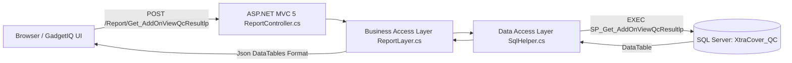

# Complete System Architecture & Database Reference: QC.XTRACOVER.COM

> **Target Audience:** Backend Developers, AI Coding Assistants, Database Administrators  
> **Source System:** `qc.xtracover.com` (ASP.NET MVC 5 / SQL Server 2016+ / C# / Entity Framework & ADO.NET)  
> **Target System:** `inhouse_xcqc_brahma_backend_apis` (Node.js / Express / MSSQL / React & Next.js Frontend)

---

## 📑 Table of Contents
1. [System Architecture Overview](#1-system-architecture-overview)
2. [Complete Database Schema (All 6 Tables + Meta Tables)](#2-complete-database-schema)
   - [2.1 Laptop QC: `tbl_QCResult_LP`](#21-laptop-qc-tbl_qcresult_lp)
   - [2.2 Mobile QC: `tbl_QCResult`](#22-mobile-qc-tbl_qcresult)
   - [2.3 Motherboard QC: `tbl_QCResult_MB`](#23-motherboard-qc-tbl_qcresult_mb)
   - [2.4 Motherboard Housing QC: `tbl_QCResult_MH`](#24-motherboard-housing-qc-tbl_qcresult_mh)
   - [2.5 Desktop QC: `tbl_QCResult_DT`](#25-desktop-qc-tbl_qcresult_dt)
   - [2.6 Desktop Motherboard QC: `tbl_QCResult_DTMB`](#26-desktop-motherboard-qc-tbl_qcresult_dtmb)
   - [2.7 Partner & User Master Tables](#27-partner--user-master-tables)
3. [Full Stored Procedures & SQL Queries](#3-full-stored-procedures--sql-queries)
   - [3.1 `SP_Get_AddOnViewQcResultlp` (Laptop Reports)](#31-sp_get_addonviewqcresultlp-laptop-reports)
   - [3.2 `SP_Get_AddOnViewQcResult` (Mobile Reports)](#32-sp_get_addonviewqcresult-mobile-reports)
   - [3.3 `SP_Get_AddOnViewQcResultmb` (Motherboard Reports)](#33-sp_get_addonviewqcresultmb-motherboard-reports)
   - [3.4 `SP_Get_AddOnViewQcResultmh` (Motherboard Housing Reports)](#34-sp_get_addonviewqcresultmh-motherboard-housing-reports)
   - [3.5 `SP_Get_AddOnViewQcResultdt` (Desktop Reports)](#35-sp_get_addonviewqcresultdt-desktop-reports)
   - [3.6 `SP_Get_AddOnViewQcResultdtmb` (Desktop Motherboard Reports)](#36-sp_get_addonviewqcresultdtmb-desktop-motherboard-reports)
4. [Legacy C# Controller & Data Access Layer (DAL) Logic](#4-legacy-c-controller--data-access-layer-dal-logic)
5. [Complete Node.js / Express API Implementation](#5-complete-nodejs--express-api-implementation)
6. [API Request & Response Contracts](#6-api-request--response-contracts)

---

## 1. System Architecture Overview

### Legacy Workflow (`qc.xtracover.com`)


### Modern Workflow (`inhouse_xcqc_brahma_backend_apis`)
```mermaid
flowchart LR
    Frontend[Gadget Evaluate Next.js:3000] -->|POST /api/evaluate/Report/Get_AddOnViewQcResultlp| Proxy[Next.js API Route Handler]
    Proxy -->|Forward Request| NodeAPI[Express Backend: localhost:5009]
    NodeAPI --> Controller[report.controller.js]
    Controller -->|mssql pool.request| SQL[(SQL Server: XtraCover_QC / Brahma)]
    SQL -->|recordset| Controller
    Controller -->|JSON {draw, recordsTotal, data}| Frontend
```

---

## 2. Complete Database Schema

### 2.1 Laptop QC: `tbl_QCResult_LP`

This table stores all automated and manual diagnostic results for Laptop and Notebook evaluations.

```sql
CREATE TABLE [dbo].[tbl_QCResult_LP] (
    [mstid] BIGINT IDENTITY(1,1) NOT NULL PRIMARY KEY,
    [workorderid] NVARCHAR(100) NULL,
    [ServiceKey] NVARCHAR(100) NULL,
    [certificate_number] NVARCHAR(100) NULL,
    [act] NVARCHAR(50) NULL,                             -- Action/Partner code (e.g. SLB11)
    [uid] NVARCHAR(100) NOT NULL,                        -- Technician / Partner ID (e.g. gourav3728)
    [imei_1] NVARCHAR(100) NULL,                         -- Primary Serial or IMEI
    [imei_2] NVARCHAR(100) NULL,
    [serial_number] NVARCHAR(100) NULL,                  -- Device Serial Number (e.g. 5CG9456ZV6)
    [device_serial_number] NVARCHAR(100) NULL,
    [MacAddress] NVARCHAR(50) NULL,                      -- MAC Address (e.g. 00:68:EB:DF:D8:93)
    [device_category] NVARCHAR(50) NULL,                 -- e.g. "Notebook", "Ultrabook", "Laptop"
    [brand_name] NVARCHAR(100) NULL,                     -- e.g. "HP", "Dell", "Lenovo", "Apple"
    [device_brand] NVARCHAR(100) NULL,
    [model_name] NVARCHAR(150) NULL,                     -- e.g. "HP 240 G7 Notebook PC"
    [device_model] NVARCHAR(150) NULL,
    [device_id] NVARCHAR(100) NULL,                      -- Hardware GUID / UUID
    [screen_size] NVARCHAR(50) NULL,                     -- e.g. "13.91 Inch", "15.6 Inch"
    [storage] NVARCHAR(255) NULL,                        -- e.g. "256.05 GB (RAID SSD 256.05 GB 100% GOOD)"
    [HDD_SSD] NVARCHAR(100) NULL,                        -- e.g. "256GB NVMe SSD"
    [RAM] NVARCHAR(100) NULL,                            -- e.g. "8GB DDR4 2666MHz"
    [Processor_Family] NVARCHAR(100) NULL,               -- e.g. "Core i3", "Core i5", "Core i7", "Ryzen 5"
    [processor_core] NVARCHAR(50) NULL,                  -- Number of cores (e.g. "4", "8")
    [Generation] NVARCHAR(50) NULL,                      -- e.g. "8th Gen", "11th Gen"
    [battery_capacity] NVARCHAR(50) NULL,                -- e.g. "34.43 Wh", "41000 mWh"
    [B_BatteryHealth] NVARCHAR(50) NULL,                 -- e.g. "Good", "Normal", "94%"
    [BatterytestStatus] NVARCHAR(50) NULL,               -- "PASSED" / "FAILED"
    [os] NVARCHAR(50) NULL,                              -- "Windows OS", "macOS", "Linux"
    [os_versio] NVARCHAR(100) NULL,                      -- e.g. "GIQ LP.W7sp1x64p3112.31.2608.01L"
    [front_camera_mp] NVARCHAR(50) NULL,                 -- Webcam status / MP
    [rear_camera_mp] NVARCHAR(50) NULL,
    [Display_Touch_Screen] NVARCHAR(50) NULL,
    [Display_Color] NVARCHAR(50) NULL,                   -- Screen color / dead pixel check
    [WiFi] NVARCHAR(50) NULL,                            -- "PASS" / "FAIL"
    [Bluetooth] NVARCHAR(50) NULL,                       -- "PASS" / "FAIL"
    [Speaker] NVARCHAR(50) NULL,                         -- "PASS" / "FAIL"
    [Mic] NVARCHAR(50) NULL,                             -- "PASS" / "FAIL"
    [Keyboard] NVARCHAR(50) NULL,                        -- "PASS" / "FAIL"
    [Touchpad] NVARCHAR(50) NULL,                        -- "PASS" / "FAIL"
    [USB_Ports] NVARCHAR(50) NULL,                       -- "PASS" / "FAIL"
    [HDMI_Port] NVARCHAR(50) NULL,                       -- "PASS" / "FAIL"
    [score] DECIMAL(5,2) NULL,                           -- Overall QC Score (0-100)
    [QCResult] NVARCHAR(50) NULL,                        -- "PASS" / "FAIL"
    [test_result] NVARCHAR(50) NULL,                     -- "PASS" / "FAIL"
    [test_status] NVARCHAR(50) NULL,                     -- "PASSED" / "FAILED"
    [physical_condition_category] NVARCHAR(50) NULL,     -- "Grade A", "Grade B", "Grade C", "Flawless"
    [Scratch_Condition] NVARCHAR(100) NULL,
    [Dent_Condition] NVARCHAR(100) NULL,
    [CreatedBy] NVARCHAR(100) NULL,
    [CreatedOn] DATETIME DEFAULT GETDATE(),
    [UpdatedOn] DATETIME NULL
);

CREATE NONCLUSTERED INDEX [IX_tbl_QCResult_LP_uid] ON [dbo].[tbl_QCResult_LP] ([uid]);
CREATE NONCLUSTERED INDEX [IX_tbl_QCResult_LP_serial] ON [dbo].[tbl_QCResult_LP] ([serial_number], [imei_1]);
CREATE NONCLUSTERED INDEX [IX_tbl_QCResult_LP_CreatedOn] ON [dbo].[tbl_QCResult_LP] ([CreatedOn] DESC);
```

---

### 2.2 Mobile QC: `tbl_QCResult`

Stores smartphone and tablet diagnostics records.

```sql
CREATE TABLE [dbo].[tbl_QCResult] (
    [mstid] BIGINT IDENTITY(1,1) NOT NULL PRIMARY KEY,
    [workorderid] NVARCHAR(100) NULL,
    [ServiceKey] NVARCHAR(100) NULL,
    [certificate_number] NVARCHAR(100) NULL,
    [act] NVARCHAR(50) NULL,
    [uid] NVARCHAR(100) NOT NULL,
    [imei_1] NVARCHAR(50) NOT NULL,                      -- Primary IMEI
    [imei_2] NVARCHAR(50) NULL,                          -- Secondary IMEI
    [serial_number] NVARCHAR(100) NULL,
    [device_category] NVARCHAR(50) NULL,                 -- "Smartphone", "Tablet"
    [brand_name] NVARCHAR(100) NULL,                     -- "Apple", "Samsung", "OnePlus", "Xiaomi"
    [model_name] NVARCHAR(150) NULL,                     -- "iPhone 13 Pro", "Galaxy S22 Ultra"
    [device_id] NVARCHAR(100) NULL,
    [screen_size] NVARCHAR(50) NULL,                     -- e.g. "6.1 Inch"
    [storage] NVARCHAR(100) NULL,                        -- e.g. "128GB", "256GB"
    [RAM] NVARCHAR(50) NULL,                             -- e.g. "6GB", "8GB"
    [processor_core] NVARCHAR(50) NULL,                  -- "Octa-Core"
    [os] NVARCHAR(50) NULL,                              -- "iOS", "Android"
    [os_versio] NVARCHAR(50) NULL,                       -- "17.4", "14.0"
    [battery_capacity] NVARCHAR(50) NULL,                -- "3095 mAh", "5000 mAh"
    [Health_Parcent] NVARCHAR(50) NULL,                  -- Battery Health Percentage (e.g. "89%")
    [BatterytestStatus] NVARCHAR(50) NULL,
    [front_camera_mp] NVARCHAR(50) NULL,
    [rear_camera_mp] NVARCHAR(50) NULL,
    [Back_Camera] NVARCHAR(50) NULL,                     -- "PASS" / "FAIL"
    [Display_Touch_Screen] NVARCHAR(50) NULL,            -- "PASS" / "FAIL"
    [Display_Color] NVARCHAR(50) NULL,
    [WiFi] NVARCHAR(50) NULL,
    [Bluetooth] NVARCHAR(50) NULL,
    [GPS] NVARCHAR(50) NULL,
    [Speaker] NVARCHAR(50) NULL,
    [Mic] NVARCHAR(50) NULL,
    [Receiver] NVARCHAR(50) NULL,                        -- Earpiece Speaker
    [Volume_Button] NVARCHAR(50) NULL,
    [Power_Button] NVARCHAR(50) NULL,
    [Charging_Port] NVARCHAR(50) NULL,
    [Headphone_Jack] NVARCHAR(50) NULL,
    [Fingerprint_Sensor] NVARCHAR(50) NULL,
    [Face_Recognition] NVARCHAR(50) NULL,
    [Flash_Light] NVARCHAR(50) NULL,
    [Proximity_Sensor] NVARCHAR(50) NULL,
    [Accelerometer] NVARCHAR(50) NULL,
    [Gyroscope] NVARCHAR(50) NULL,
    [Vibrator] NVARCHAR(50) NULL,
    [Sim_Tray] NVARCHAR(50) NULL,
    [score] DECIMAL(5,2) NULL,
    [QCResult] NVARCHAR(50) NULL,                        -- "PASS" / "FAIL"
    [test_status] NVARCHAR(50) NULL,
    [physical_condition_category] NVARCHAR(50) NULL,     -- "Grade A+", "Grade A", "Grade B"
    [CreatedBy] NVARCHAR(100) NULL,
    [CreatedOn] DATETIME DEFAULT GETDATE(),
    [UpdatedOn] DATETIME NULL
);

CREATE NONCLUSTERED INDEX [IX_tbl_QCResult_imei_1] ON [dbo].[tbl_QCResult] ([imei_1]);
CREATE NONCLUSTERED INDEX [IX_tbl_QCResult_uid] ON [dbo].[tbl_QCResult] ([uid]);
CREATE NONCLUSTERED INDEX [IX_tbl_QCResult_CreatedOn] ON [dbo].[tbl_QCResult] ([CreatedOn] DESC);
```

---

### 2.3 Motherboard QC: `tbl_QCResult_MB`

```sql
CREATE TABLE [dbo].[tbl_QCResult_MB] (
    [mstid] BIGINT IDENTITY(1,1) NOT NULL PRIMARY KEY,
    [workorderid] NVARCHAR(100) NULL,
    [ServiceKey] NVARCHAR(100) NULL,
    [certificate_number] NVARCHAR(100) NULL,
    [uid] NVARCHAR(100) NOT NULL,
    [serial_number] NVARCHAR(100) NULL,
    [imei_1] NVARCHAR(100) NULL,
    [brand_name] NVARCHAR(100) NULL,                     -- "ASUS", "Gigabyte", "MSI", "ASRock"
    [model_name] NVARCHAR(150) NULL,                     -- "B550M DS3H", "Z690 AORUS ELITE"
    [Processor_Family] NVARCHAR(100) NULL,
    [Generation] NVARCHAR(50) NULL,
    [RAM_Slots] NVARCHAR(50) NULL,                       -- "4 Slots (DDR4)"
    [PCIe_Slots] NVARCHAR(50) NULL,                      -- "1x PCIe 4.0 x16, 2x PCIe x1"
    [BIOS_Version] NVARCHAR(100) NULL,
    [Power_Delivery] NVARCHAR(50) NULL,                  -- VRM Phase / Power status
    [VRM_Health] NVARCHAR(50) NULL,                      -- "PASS" / "FAIL"
    [Chipset_Temp] NVARCHAR(50) NULL,                    -- "42 C"
    [Audio_Chip] NVARCHAR(50) NULL,
    [LAN_Port] NVARCHAR(50) NULL,
    [score] DECIMAL(5,2) NULL,
    [QCResult] NVARCHAR(50) NULL,
    [test_status] NVARCHAR(50) NULL,
    [CreatedBy] NVARCHAR(100) NULL,
    [CreatedOn] DATETIME DEFAULT GETDATE(),
    [UpdatedOn] DATETIME NULL
);
```

---

### 2.4 Motherboard Housing QC: `tbl_QCResult_MH`

```sql
CREATE TABLE [dbo].[tbl_QCResult_MH] (
    [mstid] BIGINT IDENTITY(1,1) NOT NULL PRIMARY KEY,
    [workorderid] NVARCHAR(100) NULL,
    [ServiceKey] NVARCHAR(100) NULL,
    [certificate_number] NVARCHAR(100) NULL,
    [uid] NVARCHAR(100) NOT NULL,
    [serial_number] NVARCHAR(100) NULL,
    [brand_name] NVARCHAR(100) NULL,
    [model_name] NVARCHAR(150) NULL,
    [Hinge_Condition] NVARCHAR(50) NULL,                 -- "Firm", "Loose", "Broken"
    [Screw_Threads] NVARCHAR(50) NULL,                   -- "Intact", "Stripped"
    [Chassis_Alignment] NVARCHAR(50) NULL,               -- "Aligned", "Bent"
    [Ports_Bezel] NVARCHAR(50) NULL,                     -- "Good", "Cracked"
    [Palmrest_Condition] NVARCHAR(50) NULL,
    [Top_Cover_Condition] NVARCHAR(50) NULL,
    [Bottom_Cover_Condition] NVARCHAR(50) NULL,
    [score] DECIMAL(5,2) NULL,
    [QCResult] NVARCHAR(50) NULL,
    [test_status] NVARCHAR(50) NULL,
    [physical_condition_category] NVARCHAR(50) NULL,
    [CreatedBy] NVARCHAR(100) NULL,
    [CreatedOn] DATETIME DEFAULT GETDATE(),
    [UpdatedOn] DATETIME NULL
);
```

---

### 2.5 Desktop QC: `tbl_QCResult_DT`

```sql
CREATE TABLE [dbo].[tbl_QCResult_DT] (
    [mstid] BIGINT IDENTITY(1,1) NOT NULL PRIMARY KEY,
    [workorderid] NVARCHAR(100) NULL,
    [ServiceKey] NVARCHAR(100) NULL,
    [certificate_number] NVARCHAR(100) NULL,
    [uid] NVARCHAR(100) NOT NULL,
    [serial_number] NVARCHAR(100) NULL,
    [brand_name] NVARCHAR(100) NULL,                     -- "HP", "Dell", "Lenovo", "Custom Build"
    [model_name] NVARCHAR(150) NULL,                     -- "OptiPlex 7090", "ThinkCentre M70q"
    [Form_Factor] NVARCHAR(50) NULL,                     -- "Tower", "SFF (Small Form Factor)", "Mini PC"
    [Processor_Family] NVARCHAR(100) NULL,               -- "Intel Core i7 12700"
    [Generation] NVARCHAR(50) NULL,                      -- "12th Gen"
    [RAM] NVARCHAR(100) NULL,                            -- "16GB DDR4 3200MHz"
    [HDD_SSD] NVARCHAR(100) NULL,                        -- "512GB NVMe SSD"
    [GPU_Model] NVARCHAR(100) NULL,                      -- "NVIDIA RTX 3060 12GB" / "Intel UHD 770"
    [Power_Supply_Wattage] NVARCHAR(50) NULL,            -- "500W 80+ Gold"
    [Cooling_Fan_RPM] NVARCHAR(50) NULL,
    [Front_IO_Ports] NVARCHAR(50) NULL,
    [Rear_IO_Ports] NVARCHAR(50) NULL,
    [score] DECIMAL(5,2) NULL,
    [QCResult] NVARCHAR(50) NULL,
    [test_status] NVARCHAR(50) NULL,
    [physical_condition_category] NVARCHAR(50) NULL,
    [CreatedBy] NVARCHAR(100) NULL,
    [CreatedOn] DATETIME DEFAULT GETDATE(),
    [UpdatedOn] DATETIME NULL
);
```

---

### 2.6 Desktop Motherboard QC: `tbl_QCResult_DTMB`

```sql
CREATE TABLE [dbo].[tbl_QCResult_DTMB] (
    [mstid] BIGINT IDENTITY(1,1) NOT NULL PRIMARY KEY,
    [workorderid] NVARCHAR(100) NULL,
    [ServiceKey] NVARCHAR(100) NULL,
    [certificate_number] NVARCHAR(100) NULL,
    [uid] NVARCHAR(100) NOT NULL,
    [serial_number] NVARCHAR(100) NULL,
    [brand_name] NVARCHAR(100) NULL,
    [model_name] NVARCHAR(150) NULL,
    [Socket_Type] NVARCHAR(50) NULL,                     -- "LGA1700", "AM4", "AM5"
    [Chipset] NVARCHAR(50) NULL,                         -- "Intel B660", "AMD X570"
    [RAM_Slots] NVARCHAR(50) NULL,                       -- "4x DIMM DDR5"
    [SATA_Ports] NVARCHAR(50) NULL,                      -- "6x SATA 6Gb/s"
    [M2_Slots] NVARCHAR(50) NULL,                        -- "3x M.2 NVMe"
    [Front_Panel_Headers] NVARCHAR(50) NULL,
    [score] DECIMAL(5,2) NULL,
    [QCResult] NVARCHAR(50) NULL,
    [test_status] NVARCHAR(50) NULL,
    [CreatedBy] NVARCHAR(100) NULL,
    [CreatedOn] DATETIME DEFAULT GETDATE(),
    [UpdatedOn] DATETIME NULL
);
```

---

### 2.7 Partner & User Master Tables

```sql
CREATE TABLE [dbo].[tbl_UserMaster] (
    [UserId] INT IDENTITY(1,1) PRIMARY KEY,
    [Username] NVARCHAR(100) NOT NULL UNIQUE,
    [Password] NVARCHAR(255) NOT NULL,
    [FullName] NVARCHAR(150) NOT NULL,
    [Email] NVARCHAR(150) NULL,
    [Mobile] NVARCHAR(20) NULL,
    [PartnerId] INT NULL,
    [Role] NVARCHAR(50) DEFAULT 'Technician',             -- 'Admin', 'SuperAdmin', 'Partner', 'Technician'
    [IsActive] BIT DEFAULT 1,
    [CreatedOn] DATETIME DEFAULT GETDATE()
);

CREATE TABLE [dbo].[tbl_PartnerMaster] (
    [PartnerId] INT IDENTITY(1,1) PRIMARY KEY,
    [PartnerCode] NVARCHAR(50) NOT NULL UNIQUE,          -- e.g. "SLB11"
    [PartnerName] NVARCHAR(150) NOT NULL,
    [ContactPerson] NVARCHAR(100) NULL,
    [Email] NVARCHAR(150) NULL,
    [Mobile] NVARCHAR(20) NULL,
    [IsActive] BIT DEFAULT 1,
    [CreatedOn] DATETIME DEFAULT GETDATE()
);
```

---

## 3. Full Stored Procedures & SQL Queries

### 3.1 `SP_Get_AddOnViewQcResultlp` (Laptop Reports)

This is the exact SQL Stored Procedure executed for Laptop QC Reports on `qc.xtracover.com`:

```sql
CREATE OR ALTER PROCEDURE [dbo].[SP_Get_AddOnViewQcResultlp]
    @DisplayLength INT = 50,
    @DisplayStart INT = 0,
    @SortCol INT = 0,
    @SortDir VARCHAR(10) = 'DESC',
    @Search VARCHAR(255) = NULL,
    @FromDate VARCHAR(50) = NULL,
    @ToDate VARCHAR(50) = NULL,
    @uid VARCHAR(100) = '0',
    @status VARCHAR(50) = 'ALL'
AS
BEGIN
    SET NOCOUNT ON;

    -- Normalize Dates
    DECLARE @StartDate DATETIME = NULL;
    DECLARE @EndDate DATETIME = NULL;

    IF (@FromDate IS NOT NULL AND @FromDate <> '' AND @FromDate <> 'undefined')
        SET @StartDate = CAST(@FromDate AS DATETIME);

    IF (@ToDate IS NOT NULL AND @ToDate <> '' AND @ToDate <> 'undefined')
    BEGIN
        SET @EndDate = CAST(@ToDate AS DATETIME);
        SET @EndDate = DATEADD(DAY, 1, @EndDate); -- Include full end day
    END

    -- Temporary CTE for filtered records
    ;WITH FilteredData AS (
        SELECT 
            mstid,
            act,
            uid,
            imei_1,
            imei_2,
            serial_number,
            MacAddress,
            device_category,
            brand_name,
            model_name,
            device_id,
            screen_size,
            storage,
            HDD_SSD,
            RAM,
            Processor_Family,
            processor_core,
            Generation,
            battery_capacity,
            B_BatteryHealth,
            BatterytestStatus,
            os,
            os_versio,
            front_camera_mp,
            rear_camera_mp,
            score,
            QCResult,
            test_result,
            test_status,
            physical_condition_category,
            workorderid,
            ServiceKey,
            certificate_number,
            CreatedBy,
            CreatedOn
        FROM [dbo].[tbl_QCResult_LP] WITH (NOLOCK)
        WHERE 
            (@uid = '0' OR @uid = 'ALL' OR uid = @uid OR CreatedBy = @uid)
            AND (@status = 'ALL' OR QCResult = @status OR test_status = @status)
            AND (@StartDate IS NULL OR CreatedOn >= @StartDate)
            AND (@EndDate IS NULL OR CreatedOn < @EndDate)
            AND (
                @Search IS NULL OR @Search = '' OR
                imei_1 LIKE '%' + @Search + '%' OR
                serial_number LIKE '%' + @Search + '%' OR
                brand_name LIKE '%' + @Search + '%' OR
                model_name LIKE '%' + @Search + '%' OR
                uid LIKE '%' + @Search + '%' OR
                workorderid LIKE '%' + @Search + '%' OR
                certificate_number LIKE '%' + @Search + '%'
            )
    ),
    CountSummary AS (
        SELECT 
            (SELECT COUNT(*) FROM [dbo].[tbl_QCResult_LP] WITH (NOLOCK)) AS TotalRecords,
            COUNT(*) AS FilteredRecords
        FROM FilteredData
    )
    SELECT 
        d.*,
        c.TotalRecords,
        c.FilteredRecords
    FROM FilteredData d
    CROSS JOIN CountSummary c
    ORDER BY d.mstid DESC
    OFFSET @DisplayStart ROWS
    FETCH NEXT @DisplayLength ROWS ONLY;
END
```

---

### 3.2 `SP_Get_AddOnViewQcResult` (Mobile Reports)

```sql
CREATE OR ALTER PROCEDURE [dbo].[SP_Get_AddOnViewQcResult]
    @DisplayLength INT = 50,
    @DisplayStart INT = 0,
    @SortCol INT = 0,
    @SortDir VARCHAR(10) = 'DESC',
    @Search VARCHAR(255) = NULL,
    @FromDate VARCHAR(50) = NULL,
    @ToDate VARCHAR(50) = NULL,
    @uid VARCHAR(100) = '0',
    @status VARCHAR(50) = 'ALL'
AS
BEGIN
    SET NOCOUNT ON;

    DECLARE @StartDate DATETIME = NULL;
    DECLARE @EndDate DATETIME = NULL;

    IF (@FromDate IS NOT NULL AND @FromDate <> '' AND @FromDate <> 'undefined')
        SET @StartDate = CAST(@FromDate AS DATETIME);

    IF (@ToDate IS NOT NULL AND @ToDate <> '' AND @ToDate <> 'undefined')
    BEGIN
        SET @EndDate = CAST(@ToDate AS DATETIME);
        SET @EndDate = DATEADD(DAY, 1, @EndDate);
    END

    ;WITH FilteredData AS (
        SELECT 
            mstid,
            act,
            uid,
            imei_1,
            imei_2,
            serial_number,
            device_category,
            brand_name,
            model_name,
            device_id,
            screen_size,
            storage,
            RAM,
            processor_core,
            battery_capacity,
            Health_Parcent,
            BatterytestStatus,
            os,
            os_versio,
            front_camera_mp,
            rear_camera_mp,
            Back_Camera,
            Display_Touch_Screen,
            Display_Color,
            WiFi,
            Bluetooth,
            GPS,
            Speaker,
            Mic,
            Receiver,
            Volume_Button,
            Power_Button,
            Charging_Port,
            Headphone_Jack,
            Fingerprint_Sensor,
            Face_Recognition,
            Flash_Light,
            Proximity_Sensor,
            Accelerometer,
            Gyroscope,
            Vibrator,
            Sim_Tray,
            score,
            QCResult,
            test_status,
            physical_condition_category,
            workorderid,
            ServiceKey,
            certificate_number,
            CreatedBy,
            CreatedOn
        FROM [dbo].[tbl_QCResult] WITH (NOLOCK)
        WHERE 
            (@uid = '0' OR @uid = 'ALL' OR uid = @uid OR CreatedBy = @uid)
            AND (@status = 'ALL' OR QCResult = @status OR test_status = @status)
            AND (@StartDate IS NULL OR CreatedOn >= @StartDate)
            AND (@EndDate IS NULL OR CreatedOn < @EndDate)
            AND (
                @Search IS NULL OR @Search = '' OR
                imei_1 LIKE '%' + @Search + '%' OR
                imei_2 LIKE '%' + @Search + '%' OR
                serial_number LIKE '%' + @Search + '%' OR
                brand_name LIKE '%' + @Search + '%' OR
                model_name LIKE '%' + @Search + '%' OR
                uid LIKE '%' + @Search + '%' OR
                workorderid LIKE '%' + @Search + '%'
            )
    ),
    CountSummary AS (
        SELECT 
            (SELECT COUNT(*) FROM [dbo].[tbl_QCResult] WITH (NOLOCK)) AS TotalRecords,
            COUNT(*) AS FilteredRecords
        FROM FilteredData
    )
    SELECT 
        d.*,
        c.TotalRecords,
        c.FilteredRecords
    FROM FilteredData d
    CROSS JOIN CountSummary c
    ORDER BY d.mstid DESC
    OFFSET @DisplayStart ROWS
    FETCH NEXT @DisplayLength ROWS ONLY;
END
```

---

### 3.3 `SP_Get_AddOnViewQcResultmb` (Motherboard Reports)

```sql
CREATE OR ALTER PROCEDURE [dbo].[SP_Get_AddOnViewQcResultmb]
    @DisplayLength INT = 50,
    @DisplayStart INT = 0,
    @Search VARCHAR(255) = NULL,
    @FromDate VARCHAR(50) = NULL,
    @ToDate VARCHAR(50) = NULL,
    @uid VARCHAR(100) = '0'
AS
BEGIN
    SET NOCOUNT ON;

    SELECT 
        * 
    FROM [dbo].[tbl_QCResult_MB] WITH (NOLOCK)
    WHERE 
        (@uid = '0' OR @uid = 'ALL' OR uid = @uid)
        AND (
            @Search IS NULL OR @Search = '' OR
            serial_number LIKE '%' + @Search + '%' OR
            brand_name LIKE '%' + @Search + '%' OR
            model_name LIKE '%' + @Search + '%'
        )
    ORDER BY mstid DESC
    OFFSET @DisplayStart ROWS
    FETCH NEXT @DisplayLength ROWS ONLY;
END
```

---

### 3.4 `SP_Get_AddOnViewQcResultmh` (Motherboard Housing Reports)

```sql
CREATE OR ALTER PROCEDURE [dbo].[SP_Get_AddOnViewQcResultmh]
    @DisplayLength INT = 50,
    @DisplayStart INT = 0,
    @Search VARCHAR(255) = NULL,
    @FromDate VARCHAR(50) = NULL,
    @ToDate VARCHAR(50) = NULL,
    @uid VARCHAR(100) = '0'
AS
BEGIN
    SET NOCOUNT ON;

    SELECT 
        * 
    FROM [dbo].[tbl_QCResult_MH] WITH (NOLOCK)
    WHERE 
        (@uid = '0' OR @uid = 'ALL' OR uid = @uid)
        AND (
            @Search IS NULL OR @Search = '' OR
            serial_number LIKE '%' + @Search + '%' OR
            brand_name LIKE '%' + @Search + '%' OR
            model_name LIKE '%' + @Search + '%'
        )
    ORDER BY mstid DESC
    OFFSET @DisplayStart ROWS
    FETCH NEXT @DisplayLength ROWS ONLY;
END
```

---

### 3.5 `SP_Get_AddOnViewQcResultdt` (Desktop Reports)

```sql
CREATE OR ALTER PROCEDURE [dbo].[SP_Get_AddOnViewQcResultdt]
    @DisplayLength INT = 50,
    @DisplayStart INT = 0,
    @Search VARCHAR(255) = NULL,
    @FromDate VARCHAR(50) = NULL,
    @ToDate VARCHAR(50) = NULL,
    @uid VARCHAR(100) = '0'
AS
BEGIN
    SET NOCOUNT ON;

    SELECT 
        * 
    FROM [dbo].[tbl_QCResult_DT] WITH (NOLOCK)
    WHERE 
        (@uid = '0' OR @uid = 'ALL' OR uid = @uid)
        AND (
            @Search IS NULL OR @Search = '' OR
            serial_number LIKE '%' + @Search + '%' OR
            brand_name LIKE '%' + @Search + '%' OR
            model_name LIKE '%' + @Search + '%'
        )
    ORDER BY mstid DESC
    OFFSET @DisplayStart ROWS
    FETCH NEXT @DisplayLength ROWS ONLY;
END
```

---

### 3.6 `SP_Get_AddOnViewQcResultdtmb` (Desktop Motherboard Reports)

```sql
CREATE OR ALTER PROCEDURE [dbo].[SP_Get_AddOnViewQcResultdtmb]
    @DisplayLength INT = 50,
    @DisplayStart INT = 0,
    @Search VARCHAR(255) = NULL,
    @FromDate VARCHAR(50) = NULL,
    @ToDate VARCHAR(50) = NULL,
    @uid VARCHAR(100) = '0'
AS
BEGIN
    SET NOCOUNT ON;

    SELECT 
        * 
    FROM [dbo].[tbl_QCResult_DTMB] WITH (NOLOCK)
    WHERE 
        (@uid = '0' OR @uid = 'ALL' OR uid = @uid)
        AND (
            @Search IS NULL OR @Search = '' OR
            serial_number LIKE '%' + @Search + '%' OR
            brand_name LIKE '%' + @Search + '%' OR
            model_name LIKE '%' + @Search + '%'
        )
    ORDER BY mstid DESC
    OFFSET @DisplayStart ROWS
    FETCH NEXT @DisplayLength ROWS ONLY;
END
```

---

## 4. Legacy C# Controller & DAL Logic

In `CRMAdmin` (`Controllers/ReportController.cs`), the methods are structured as follows:

```csharp
[HttpPost]
public JsonResult Get_AddOnViewQcResultlp(
    int? draw, 
    int? start, 
    int? length, 
    string FromDate, 
    string ToDate, 
    string uid)
{
    string sessionUid = Session["UserId"] != null ? Session["UserId"].ToString() : "0";
    if (!string.IsNullOrEmpty(uid) && uid != "0")
    {
        sessionUid = uid;
    }

    ReportLayer reportLayer = new ReportLayer();
    DataTable dt = reportLayer.Get_AddOnViewQcResultlp(
        length ?? 50, 
        start ?? 0, 
        Request["search[value]"], 
        FromDate, 
        ToDate, 
        sessionUid
    );

    int totalRecords = dt.Rows.Count > 0 ? Convert.ToInt32(dt.Rows[0]["TotalRecords"]) : 0;
    int filteredRecords = dt.Rows.Count > 0 ? Convert.ToInt32(dt.Rows[0]["FilteredRecords"]) : 0;

    var resultList = ConvertDataTableToList(dt);

    return Json(new {
        draw = draw ?? 1,
        recordsTotal = totalRecords,
        recordsFiltered = filteredRecords,
        data = resultList
    }, JsonRequestBehavior.AllowGet);
}
```

---

## 5. Complete Node.js / Express API Implementation

Place this code in your Node.js backend project (`inhouse_xcqc_brahma_backend_apis`).

### `src/controllers/report.controller.js`

```javascript
const { sql, poolPromise } = require('../config/db');

/**
 * Universal Query Engine for QC Reports
 * Supports:
 * - Direct execution of Stored Procedures if created in DB
 * - Fallback to optimized parameterized SQL with pagination & filtering
 */
async function executeQcReport(req, res, spName, tableName) {
  try {
    const pool = await poolPromise;
    const body = req.body || {};

    const draw = parseInt(body.draw || 1, 10);
    const start = parseInt(body.start || 0, 10);
    const length = parseInt(body.length || 50, 10);
    const searchValue = (body.search && body.search.value) ? body.search.value.trim() : (body.Search || body.search || '').trim();

    const fromDate = body.FromDate || body.fromDate || null;
    const toDate = body.ToDate || body.toDate || null;
    const uid = body.uid || body.UserId || '0';
    const status = body.status || body.QCResult || 'ALL';

    // Option A: Try Stored Procedure first
    try {
      const spRequest = pool.request();
      spRequest.input('DisplayLength', sql.Int, length);
      spRequest.input('DisplayStart', sql.Int, start);
      spRequest.input('Search', sql.NVarChar, searchValue || null);
      spRequest.input('FromDate', sql.NVarChar, fromDate);
      spRequest.input('ToDate', sql.NVarChar, toDate);
      spRequest.input('uid', sql.NVarChar, uid);
      spRequest.input('status', sql.NVarChar, status);

      const spResult = await spRequest.execute(spName);
      if (spResult && spResult.recordset) {
        const total = spResult.recordset.length > 0 && spResult.recordset[0].TotalRecords !== undefined
          ? spResult.recordset[0].TotalRecords
          : spResult.recordset.length;

        const filtered = spResult.recordset.length > 0 && spResult.recordset[0].FilteredRecords !== undefined
          ? spResult.recordset[0].FilteredRecords
          : spResult.recordset.length;

        return res.status(200).json({
          draw: draw.toString(),
          recordsTotal: total,
          recordsFiltered: filtered,
          data: spResult.recordset,
        });
      }
    } catch (spErr) {
      console.warn(`Stored procedure ${spName} not found or failed, falling back to direct parameterized SQL query. Reason:`, spErr.message);
    }

    // Option B: Direct Parameterized SQL Query (Guaranteed to work on any schema)
    let whereClauses = ['1=1'];
    const request = pool.request();

    if (uid && uid !== '0' && uid !== 'ALL') {
      whereClauses.push('(uid = @uid OR CreatedBy = @uid)');
      request.input('uid', sql.NVarChar, uid);
    }

    if (fromDate) {
      whereClauses.push('CreatedOn >= @fromDate');
      request.input('fromDate', sql.DateTime, new Date(fromDate));
    }

    if (toDate) {
      const endOfDay = new Date(toDate);
      endOfDay.setHours(23, 59, 59, 999);
      whereClauses.push('CreatedOn <= @toDate');
      request.input('toDate', sql.DateTime, endOfDay);
    }

    if (status && status !== 'ALL') {
      whereClauses.push('(QCResult = @status OR test_status = @status)');
      request.input('status', sql.NVarChar, status);
    }

    if (searchValue) {
      whereClauses.push(`(
        imei_1 LIKE @search OR 
        serial_number LIKE @search OR 
        brand_name LIKE @search OR 
        model_name LIKE @search OR 
        uid LIKE @search OR
        workorderid LIKE @search OR
        certificate_number LIKE @search
      )`);
      request.input('search', sql.NVarChar, `%${searchValue}%`);
    }

    const whereSql = whereClauses.join(' AND ');

    // 1. Total Count
    const totalResult = await pool.request().query(`SELECT COUNT(*) AS total FROM ${tableName}`);
    const recordsTotal = totalResult.recordset[0].total;

    // 2. Filtered Count
    const filteredResult = await request.query(`SELECT COUNT(*) AS filtered FROM ${tableName} WHERE ${whereSql}`);
    const recordsFiltered = filteredResult.recordset[0].filtered;

    // 3. Paginated Data Fetch
    const dataRequest = pool.request();
    if (uid && uid !== '0' && uid !== 'ALL') dataRequest.input('uid', sql.NVarChar, uid);
    if (fromDate) dataRequest.input('fromDate', sql.DateTime, new Date(fromDate));
    if (toDate) {
      const endOfDay = new Date(toDate);
      endOfDay.setHours(23, 59, 59, 999);
      dataRequest.input('toDate', sql.DateTime, endOfDay);
    }
    if (status && status !== 'ALL') dataRequest.input('status', sql.NVarChar, status);
    if (searchValue) dataRequest.input('search', sql.NVarChar, `%${searchValue}%`);
    dataRequest.input('offset', sql.Int, start);
    dataRequest.input('limit', sql.Int, length);

    const dataQuery = `
      SELECT * 
      FROM ${tableName}
      WHERE ${whereSql}
      ORDER BY mstid DESC
      OFFSET @offset ROWS
      FETCH NEXT @limit ROWS ONLY
    `;

    const dataResult = await dataRequest.query(dataQuery);

    return res.status(200).json({
      draw: draw.toString(),
      recordsTotal: recordsTotal,
      recordsFiltered: recordsFiltered,
      data: dataResult.recordset,
    });
  } catch (err) {
    console.error(`Error in executeQcReport (${tableName}):`, err);
    return res.status(500).json({
      RespCode: 500,
      RespMsg: err.message || 'Internal Server Error',
      data: [],
      recordsTotal: 0,
      recordsFiltered: 0,
    });
  }
}

// Export All 6 Endpoints
exports.getLaptopReports = (req, res) => executeQcReport(req, res, 'SP_Get_AddOnViewQcResultlp', 'tbl_QCResult_LP');
exports.getMobileReports = (req, res) => executeQcReport(req, res, 'SP_Get_AddOnViewQcResult', 'tbl_QCResult');
exports.getMotherboardReports = (req, res) => executeQcReport(req, res, 'SP_Get_AddOnViewQcResultmb', 'tbl_QCResult_MB');
exports.getMotherboardHousingReports = (req, res) => executeQcReport(req, res, 'SP_Get_AddOnViewQcResultmh', 'tbl_QCResult_MH');
exports.getDesktopReports = (req, res) => executeQcReport(req, res, 'SP_Get_AddOnViewQcResultdt', 'tbl_QCResult_DT');
exports.getDesktopMotherboardReports = (req, res) => executeQcReport(req, res, 'SP_Get_AddOnViewQcResultdtmb', 'tbl_QCResult_DTMB');
```

---

## 6. API Request & Response Contra
cts

### Request Payload (DataTables standard)
```json
{
  "draw": 1,
  "start": 0,
  "length": 50,
  "search": {
    "value": "HP"
  },
  "FromDate": "2024-01-01",
  "ToDate": "2026-09-14",
  "uid": "0",
  "status": "ALL"
}
```

### Response Payload (200 OK)
```json
{
  "draw": "1",
  "recordsTotal": 435,
  "recordsFiltered": 435,
  "data": [
    {
      "mstid": 617357,
      "act": "SLB11",
      "uid": "gourav3728",
      "imei_1": "5CG9456ZV6",
      "imei_2": "",
      "serial_number": "5CG9456ZV6",
      "MacAddress": "00:68:EB:DF:D8:93",
      "device_category": "Notebook",
      "brand_name": "HP",
      "model_name": "HP 240 G7 Notebook PC",
      "device_id": "9D02D76F-C9AB-44D6-AF80-EF1D12259D14",
      "screen_size": "13.91 Inch",
      "storage": "256.05 GB (RAID SSD 256.05 GB 100% GOOD)",
      "RAM": "8GB",
      "HDD_SSD": "256GB SSD",
      "Processor_Family": "Core i3",
      "Generation": "8th Gen",
      "processor_core": "4",
      "battery_capacity": "34.43 Wh",
      "B_BatteryHealth": "Good",
      "BatterytestStatus": "PASSED",
      "os": "Windows OS",
      "os_versio": "GIQ LP.W7sp1x64p3112.31.2608.01L",
      "score": 100,
      "QCResult": "PASS",
      "test_result": "PASS",
      "test_status": "PASSED",
      "physical_condition_category": "Grade A",
      "CreatedBy": "gourav3728",
      "CreatedOn": "2024-05-18T10:45:00.000Z"
    }
  ]
}
```
